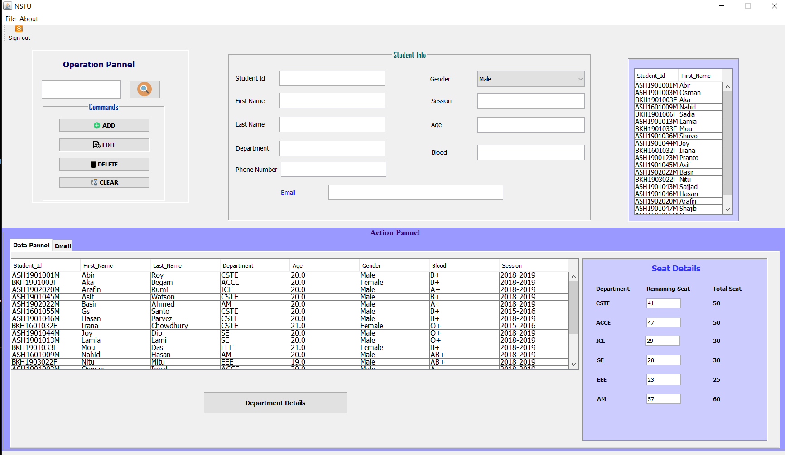

# JAVA swing project: University Admission Processes Desktop APP

<!-- &nbsp; -->

I did this project for my academic purpose, basically for the DBMS subject.
Here I tried to implement a Admission Registration process.

# Features
* CRUD - create, read, update, delete operation with search option
* JDBC
* Desktop app with java swing
* Nice and easy to use with a suitable view.
* Sqlite database system
* Send mail to users

# Screenshots
> Login page

After running this project this login window will pop up.
Use 123 as username and password.

Then a successful message will popup like the following message

> Dashboard

From here, you can perform all operations like CRUD & search

> Linked page

> developers

# Requirements and Tools:
I did this project on Netbeans IDE.

You check this on your side. But You need to add three jar file.

* mail.jar
*sqlite-jdbc.jar
*rs2xml.jar

Don't forget to resolve those issue by adding jar files.

# <a href="" ><strong>Project link</strong> </a>

---

<strong>made by Shuvo Saha Roy with 💕 and 🤘</strong>
